# Usage avancé

## Choix de l'algorithme de clustering

#### Hierarchical Agglomerative Clustering

Cet algorithme est le plus recommandé lorsque la population ne contient pas trop de patients.

```python
from tak import TakBuilder, TakVisualizer

tak_hca = TakBuilder(base).build()
tak_hca.fit()
tak_hca_viz = TakVisualizer(tak_hca)
tak_hca_viz.process_visualization()
tak_hca_viz.get_plot()
```

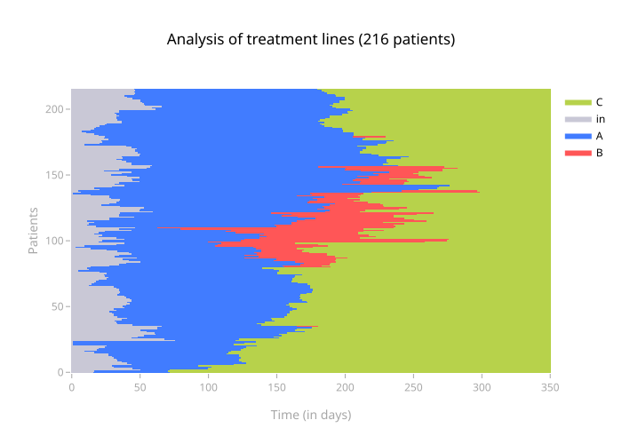

!!! note
    Au moment du `fit()`, il est possible de changer de distance (`hamming` par défaut), ou de méthode de linkage (`ward`par défaut).

#### Random

Cet algorithme est utilisé pour avoir un exemple de TAK sans clustering (pour les benchmarks par exemple).

```python
from tak import TakBuilder, TakVisualizer

tak_random = TakBuilder(base).build("random")
tak_random.fit()
tak_random_viz = TakVisualizer(tak_random)
tak_random_viz.process_visualization()
tak_random_viz.get_plot()
```

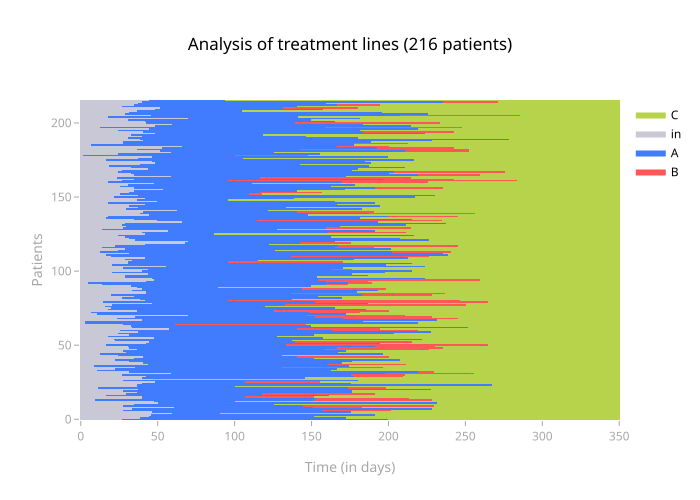


#### Custom sort

Le TAK "custom" nous permet de définir nous même le clustering des patients sur le TAK. Il y a deux utilisations principales :

- une fois que l'on a déjà réalisé un TAK classique, ajouter des nouveaux éléments sur l'image résultante du TAK (événements ponctuels, événements antérieurs ou postérieurs à la période de suivi) tout en conservant l'ordre des patients.
- Sauvegarder le résultat d'un tak en sauvegardant les clusters pour pouvoir reproduire et retravailler des visuels sans avoir à refaire de fit.

```python
from tak import TakBuilder, TakVisualizer

tak_custom = TakBuilder(base).build("custom_sort")
tak_custom.fit(list_ids_cluster = [[list(range(NB_PATIENTS))]])
tak_custom_viz = TakVisualizer(tak_custom)
tak_custom_viz.process_visualization()
tak_custom_viz.get_plot()
```

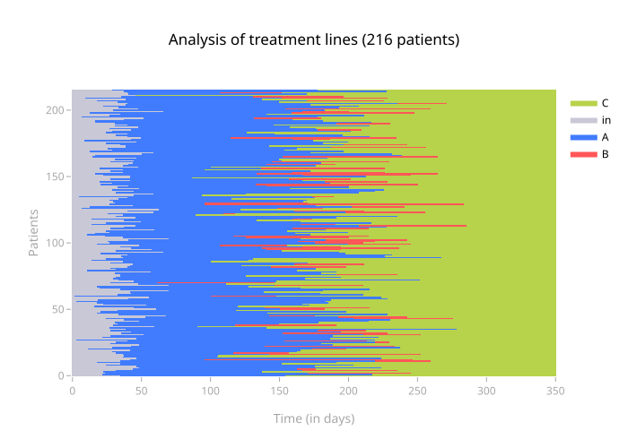

!!! info
    Le format attendu est le même que l'attribut `tak_fitted.list_ids_cluster` à savoir une liste d'arrays numpy. On peut donc directement réinjecter le résultat d'un tak dans un tak custom. De manière plus claire, la structure est :

    - clusters (list)
        - numpy array of patient ids (int). Not patient index

Exemple de clusters faits à la main :
```python
from tak import TakBuilder, TakVisualizer

tak_custom = TakBuilder(base).build("custom_sort")
tak_custom.fit(
    list_ids_cluster=[
        list(range(NB_PATIENTS // 3)),
        list(range(NB_PATIENTS // 3, NB_PATIENTS)),
    ]
)
tak_custom_viz = TakVisualizer(tak_custom)
tak_custom_viz.process_visualization()
tak_custom_viz.get_plot(add_sep=True)
```

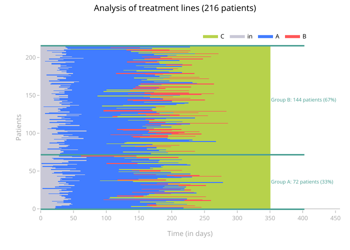

## Paramètrage du fit

!!! note "Meta Tak"
    Ce paramétrage est aussi valable pour un meta tak, donnant le paramétrage du clustering des séquances médoides. 

- `n_clusters`: le nombre de clusters à chercher
- `method`: méthode pour le calcul de la matrice de linkage. Les valeurs possibles sont "ward", "single", "complete", "average". Ce paramètre peut souvent être laissé à la valeur apr défaut, qui est "ward"
- `distance`: distance utilisée pour faire le clustering. Peut être n'importe quelle valeur possible pour l'argument metric de [scipy.spatial.distance.pdist](https://docs.scipy.org/doc/scipy-1.16.0/reference/generated/scipy.spatial.distance.pdist.html), "hamming" par défaut. Peut aussi être une fonction personallisée voir [#customiser-la-distance](#customiser-la-distance)

### Optimal ordering 

Lorsqu'on fait un clustering hiérarchique, plusieurs paramètres concernant l'optimal ordering peuvent être donnés à la méthode fit. L'optimal ordering consiste à réordonner les feuilles d'un arbre afin de minimiser la distance entre deux feuilles successives. Cela permet dans la visualisation de mieux apprécier la variété des séquences au sein de chaque cluster en mettant les séquences proches ensemble. Cependant, cet algorithme étant coûteux en tant de calcul, deux paramètres booléens sont disponibles pour spécifier le compromis souhaité. 

- `global_optimal_ordering` (default False): faire l'optimal ordering sur tout l'arbre. Compléxité en $O(n_{patiens}^2)$.
- `optimal_ordering` (default True): faire l'optimal ordering après le clustering, au sein de chaque cluster uniquement. Compléxité en $O(n_{PatClusterMax}^2)$, où $n_{PatClusterMax}$ est la taille du plus grand cluster trouvé. Peut aboutir sur la figure à des frontières étranges entre les clusters. 


## Customiser le résultat du TAK

#### Changer les couleurs d'un évènement

La fonction `update_colors()` permet de changer les couleurs d'évènements affichés sur le TAK.

Elle peut prendre différents arguments :

- Un dictionnaire `{"nom de l'évènement" : "couleur en RGB ou Hexadécimal"}`
- Le nom de l'évènement en argument et la couleur en valeur

```python
from tak import TakBuilder, TakVisualizer

tak = TakBuilder(base).build()
tak.fit()
tak_viz = TakVisualizer(tak)

tak_viz.update_colors(
    dict_new_colors={"A": "rgb(255, 114, 64)"}, B="#5E5A85"
)
tak_viz.process_visualization()
tak_viz.get_plot()
```

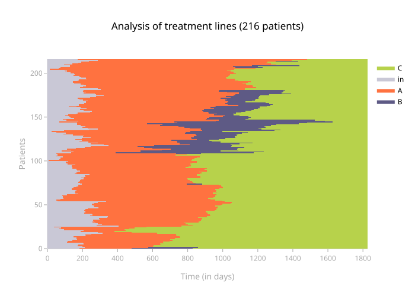

!!! warning
    Il faut utiliser la fonction `process_visualization()` **après** et non **avant** avoir changé les couleurs.

#### Changer le nom des événements

Lors de l'appel de la classe `TakVisualizer()` il est possible de passer le dictionnaire `dico_evt_for_legend` qui permet de renommer le nom des événements dans la légende.

!!! note
    Ces nouveaux noms de légendes sont effectifs pour la figure du TAK ainsi que pour les **courbes sous le TAK**.

```python
from tak import TakBuilder, TakVisualizer

tak = TakBuilder(base).build()
tak.fit()
tak_viz = TakVisualizer(tak, dico_evt_for_legend = {"A": "Nouveau nom pour A"})

tak_viz.process_visualization()
tak_viz.get_plot()
```

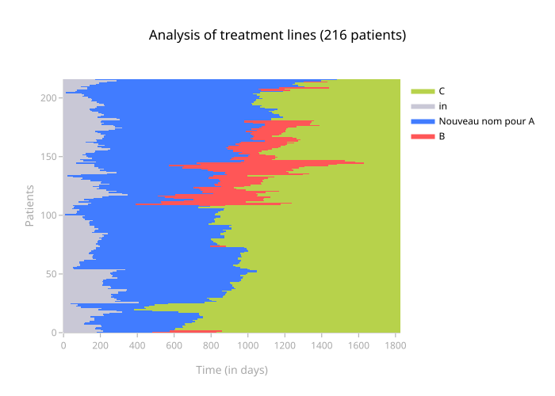


#### Ajouter une grille sur le TAK

Il est possible d'ajouter une grille sur la heatmap du TAK, sur l'axe de X et/ou sur l'axe des Y, via `add_xgrid`, `add_ygrid`.
Les fonctions plotly utilisées sont `add_hline()` et `add_vline()`.
Il est également possible de changer les paramètres entrant dans ces fonctions via `xgrid_params` et `ygrid_params`.

!!! note
    Par défaut on va ajouter la grille à la fois sur X et sur Y, avec pour arguments `xgrid_params` et `ygrid_params` :
    `line_width = 0.5`, `line_dash = "dot"`, `line_color = "grey"`, `opacity = 0.5`

```python
from tak import TakBuilder, TakVisualizer
from tak.visualization import add_grid_on_tak_fig

tak = TakBuilder(base).build()
tak.fit()
tak_viz = TakVisualizer(tak)

tak_viz.process_visualization()
fig = tak_viz.get_plot()
fig = add_grid_on_tak_fig(
    fig,
    add_xgrid=True,
    add_ygrid=True,
    xgrid_params={"opacity": 1},
    ygrid_params={"opacity": 1}
)
fig
```

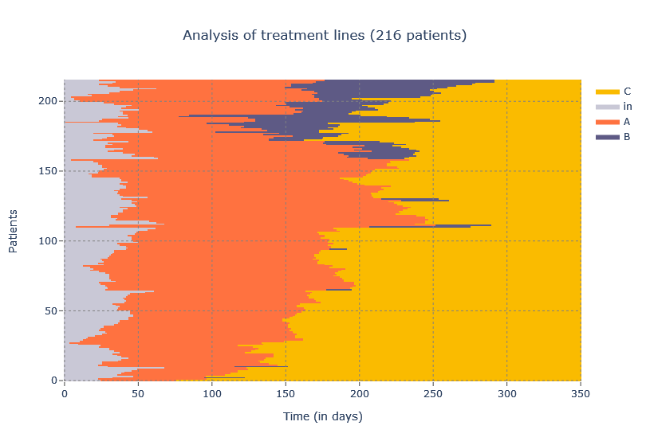

### Calendar x axes

Il est possible de demander à ce que les ticks de l'axe des abscisses soit noté tous les N mois,
en mettant unit_as_months à True et nb_months à N.

```python
tak_viz.get_plot(unit_as_months=True, nb_months=2)
```


Si le suivi du TAK est long on peut également faire un axe des X en année via l'argument `unit_as_years`.

```python
tak_viz.get_plot(unit_as_years=True)
```

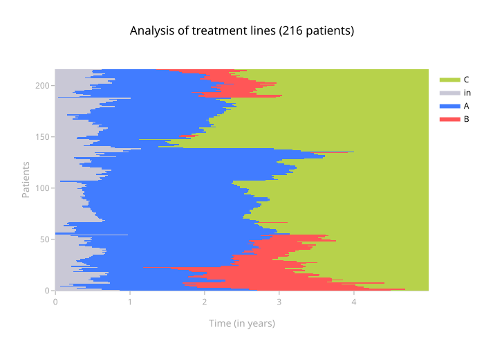

Il est également possible de convertir en dates via l'argument `base_date`.
Attention à ne pas indiquer `unit_as_years=True`, ça supprimera les dates...

```python
tak_viz.process_visualization(base_date=pd.to_datetime("2014-01-01"))
tak_viz.get_plot(unit_as_years=False)
```


## Afficher les clusters

En précisant en argument de `fit` le nombre de clusters `n_clusters`, il est possible de trouver et d'afficher automatiquement les clusters de patient.

```python
from tak import TakBuilder, TakVisualizer

n_clusters = 3

tak = TakBuilder(base).build()
tak.fit(n_clusters=n_clusters)

tak_viz = TakVisualizer(tak)
tak_viz.process_visualization()
figplotly_with_default_sep = tak_viz.get_plot(add_sep=True)
figplotly_with_default_sep.show()
```

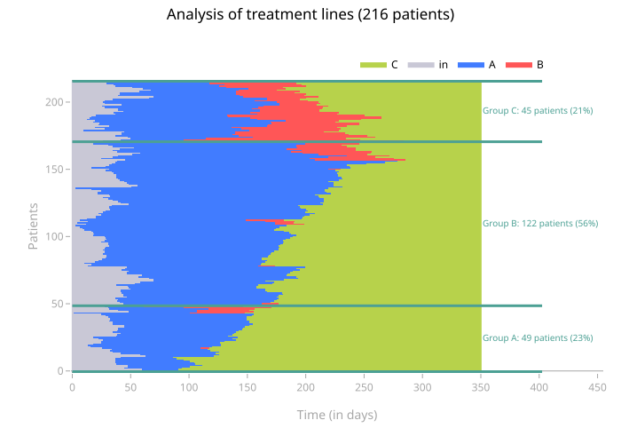

La taille des annotations, ainsi que leur couleur peut être changée,
via `size_annotation` (default `10`) et `color_annotation` (default `"#4CA094"`).

```python
figplotly_with_changed_annotation = tak_viz.get_plot(
    add_sep=True, size_annotation=20, color_annotation="#0000FF"
)
figplotly_with_changed_annotation.show()
```

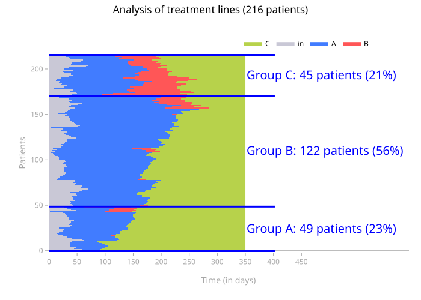

La taille des barres horizontales peut être changée via `coef_line_extension`,
elle est de `0.15` par défaut (pour une extension des barres à droite de 15%).
L'épaisseur des barres horizontales peut être changée via `width_line`,
elle est de `3` par défaut.

```python
figplotly_with_changed_line_extension_and_width = tak_viz.get_plot(
    add_sep=True, coef_line_extension=0.3, width_line=10
)
figplotly_with_changed_line_extension_and_width.show()
```

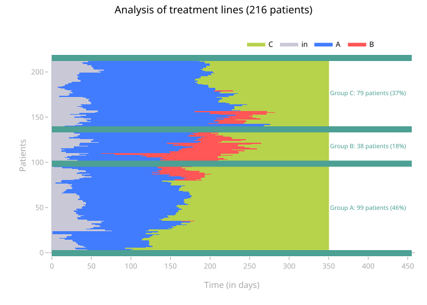

## Customiser la distance

La distance utilisée par le TAK est la distance de Hamming.
`TIMESTAMP` par `TIMESTAMP`, elle attribue 1 si les traitements des 2 patients sont différents et 0 s'ils sont identiques, puis tous ces `1` sont sommés et le résultat est divisé par le nombre de `TIMESTAMP`.

Cette distance peut être modifiée, soit par une [distance précodée par `scipy`](https://docs.scipy.org/doc/scipy/reference/generated/scipy.spatial.distance.pdist.html), soit par une fonction maison.

Par exemple, lorsque les patients de la cohorte ont des temps/périodes de suivi très différents, il peut être utile de mettre un poids plus faible sur leurs périodes "hors suivi" .
Ou bien, lorsque 2 médicaments sont cliniquement "plus proches" (par exemple `Drug_A_MCO` et `Drug_A_HAD`), il peut être utile de mettre un poids plus fort sur leur distance avec d'autres médicaments.

```python
import numpy as np

def hamming_02(u, v):
    """Métrique de distance compilée pour laquelle les instants impliquant
    start (id 0), out (id 2) ou death (id 3) sont 5 fois moins pris en compte
    dans le calcul de distance que les autres instants.

    Example:
    u             = [  0  |  0  |  0  |  5  |  2  |  2  ]
    v             = [  5  |  5  |  5  |  5  |  5  |  5  ]
    hamming       = [  1  |  1  |  1  |  0  |  1  |  1  ]
    weight        = [ 0.2 | 0.2 | 0.2 |  1  | 0.2 | 0.2 ]
    d_per_instant = [ 0.2 | 0.2 | 0.2 |  0  | 0.2 | 0.2 ]
    d             =  0.2*5 / (1 + 0.2*5) =  1 / 2  =  0.5
    """

    # parametres
    coef = 0.2
    id_low_dist = [0, 2, 3] # id des événements : ["start", "out", "death"]

    # hamming classique
    hamming = u != v

    u_low_dist = np.isin(u, id_low_dist)
    v_low_dist = np.isin(v, id_low_dist)

    weight = np.where(np.logical_or(u_low_dist, v_low_dist), coef, 1)
    hamming_weighted = np.multiply(hamming, weight)

    # normalisation
    res = hamming_weighted.sum()/weight.sum()

    return res
```

!!! note "Note : `coef`"
    Si `coef = 0`, alors la distance se calcule en "tout ou rien" : lorsque le patient est en start, out ou décès, il n'est plus pris en compte.
    Sinon `coef` est un `float`, plus il est proche de 0, moins les événements de `id_low_dist` ont du poids dans la distance, plus il est grand, plus ils ont du poids.
    Si `coef = 1`, nous revenons sur la distance de Hamming classique.

!!! warning "Warning : `id utilisés`"
    La distance se fait entre les IDs des événements, ainsi pensez à vérifier que dans tous les cas de figures les IDs indiqués dans votre fonction distance correspondent bien aux événements sur lesquels vous voulez customiser la distance (par exemple au moyen de `tak.dict_label_id`)

!!! note "Note : vectorisez !"
    Travailler avec une distance customisée rend tous les calculs plus longs.
    Il est très important d'éviter les boucles `for`, et donc de travailler en appel vectorisé (via des array numpy)

!!! note "Note : `numba`"
    L'utilisation de `numba` (décorateur `@nb.njit`) permet d'accélérer le calcul (facteur de 4 sur une estimation).
    Malheureusement `numba` ne reconnait pas `np.isin`, il faut donc écrire les choses de manière détournée si l'on veut utiliser numba (exemple ci-dessous).

```python
import numpy as np
import numba as nb

@nb.njit
def hamming_02_numba(u, v):
    """Métrique de distance compilée pour laquelle les instants impliquant
    start (id 0), out (id 2) ou death (id 3) sont 5 fois moins pris en compte
    dans le calcul de distance que les autres instants.

    Example:
    u             = [  0  |  0  |  0  |  5  |  2  |  2  ]
    v             = [  5  |  5  |  5  |  5  |  5  |  5  ]
    hamming       = [  1  |  1  |  1  |  0  |  1  |  1  ]
    weight        = [ 0.2 | 0.2 | 0.2 |  1  | 0.2 | 0.2 ]
    d_per_instant = [ 0.2 | 0.2 | 0.2 |  0  | 0.2 | 0.2 ]
    d             =  0.2*5 / (1 + 0.2*5) =  1 / 2  =  0.5
    """

    # parametres
    coef = 0.2

    # hamming classique
    hamming = u != v

    u_low_dist = (u == 0) | (u == 2) | (u == 3)
    v_low_dist = (v == 0) | (v == 2) | (v == 3)

    weight = np.where(np.logical_or(u_low_dist, v_low_dist), coef, 1)
    hamming_weighted = np.multiply(hamming, weight)

    # normalisation
    res = hamming_weighted.sum()/weight.sum()

    return res
```

Il peut aussi être intéressant d'augmenter le poids de l'alignement sur certaines parties de la fenêtre temporelle :

```python
import numpy as np

def hamming_ponderation_around_end_of_line(u, v, time_end_line):
    """Métrique de distance compilée pour laquelle les instants proches de time_end_line
    sont pondérés pour avoir plus d'importance
    """

    # hamming classique
    hamming = u != v

    # ponderation
    # on veut grandement favoriser les poids autour de t=0 sur le TAK (qui est en fait à time_end_line
    # car le TAK ne prend pas d'evts négatifs en entrée)
    weight = np.append(
        np.logspace(0.25, 1, time_end_line),  # poids croissant de t=0 à time_end_line
        np.logspace(0.25, 1, len(u) - time_end_line)[
            ::-1
        ],  # poids décroissant de t=time_end_line à la fin
    )
    hamming_weighted = np.multiply(hamming, weight)

    # normalisation
    res = hamming_weighted.sum() / weight.sum()

    return res
```

## Sélectionner un sous-TAK

Une fois le TAK entraîné, il est possible de ne sélectionner qu'une sous population à afficher.

Prenons l'exemple d'un TAK entraîné :

```python
    tak = TakBuilder(base).build()
    tak.fit()

    tak_viz = TakVisualizer(tak)
    tak_viz.process_visualization()
    tak_viz.get_plot()
```

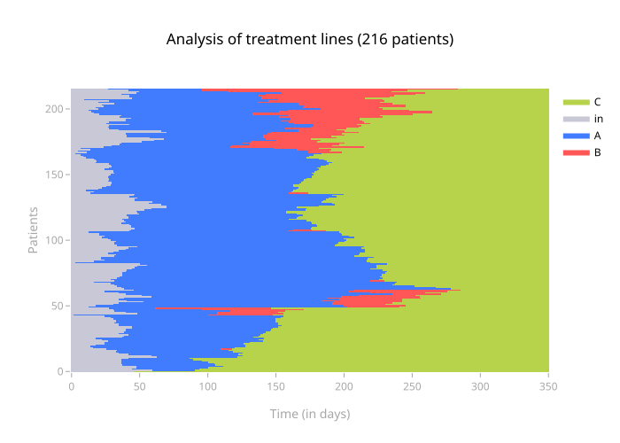

Nous pouvons n'afficher que les patients compris dans la liste `range(100)` grâce à la méthode `split()`.

```python
    # Split : Only select patients between ID 0 and ID 100
    tak_viz.split(list(range(100)))
    tak_viz.process_visualization()
    tak_viz.get_plot()
```

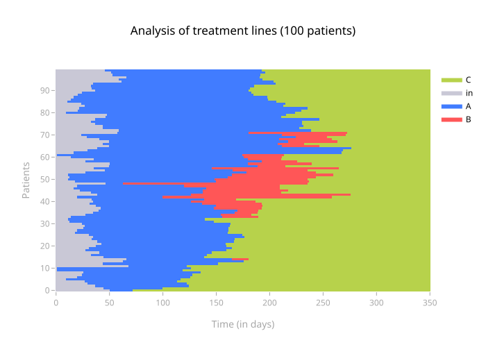

!!! note "Note : `reset_split()`"
    Pour réinitialiser l'objet `TakVisualizer`, il faut utiliser la méthode `reset_split()`.

Cette même méthode fonctionne sur un TAK comprenant plusieurs clusters.

```python
    tak = TakBuilder(base).build()
    tak.fit(n_sub_clusters=3)

    tak_viz = TakVisualizer(tak)
    tak_viz.process_visualization()
    tak_viz.get_plot(add_sep=True)
```

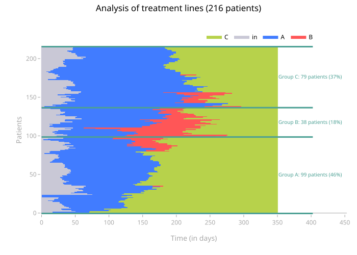

L'utilisation de la méthode `split()` ne perturbe pas l'affichage des séparations.

```python
    tak_viz.split(list(range(100)))
    tak_viz.process_visualization()
    tak_viz.get_plot(add_sep=True)
```

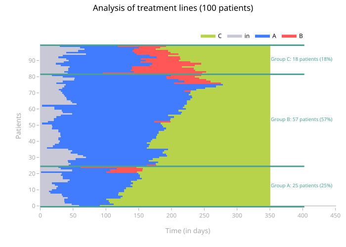

## Visualiser le dendrogramme

Visualiser le dendrogramme peut être utile pour déterminer visuellement le nombre de clusters souhaité.

```python
    tak_viz.get_plot(dendrogram=True)
```

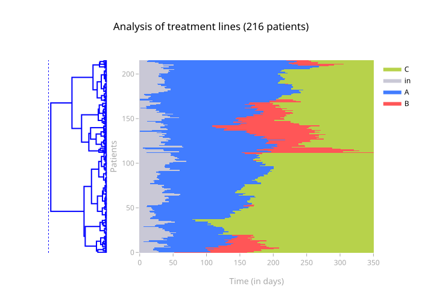

Cette fonction a plus de sens avec `add_sep`, car on peut y mettre en relation les clusters trouvés avec les sous-arbres du dendrogramme.

```python
    tak_viz.get_plot(add_sep=True, dendrogram=True)
```

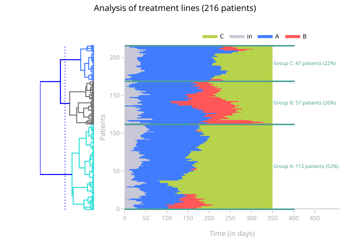

!!! warning "Optimal ordering"
    Le dendrogramme ne correspondra aux clusters affichés sur le tak que si global_optimal_ordering est à True dans le fit. En effet, l'optimal ordering normal réordonne les patients dans chaque cluster, mais sans changer le dendrogramme. 


## Ajouter une couleur *"autre"* dans la visualisation

Lorsque l'on a trop de diversité dans certaines zones de l'image résultante, on crée une couleur *autre* avec `_reduce_matrix()`.

Il est possible de redéfinir la fonction `_reduce_matrix()` afin de griser les zones trop incertaines, et ainsi de ne pas biaiser
le résultat fourni par l'image résultante.

Ici on rajoute une nouvelle modalité à la variable `method` --> `mode_weighted_thresh`.
Cette méthode permet de :
- diminuer les poids de certains événements choisis
- ne colorer une zone que si l'événement majoritaire représente plus de 50% des événements de la zone (après pondération)
- ne colorer une zone que s'il y a moins de `N` événements distincts dans la zone

Les zones qui ne remplissent pas ces critères seront colorés avec l'événement `autre`.

!!! warning "code legacy"
    Le code suivant est un snippet qui utilisait le code legacy du tak. Il n'a pas encore été retesté en mission, mais est utile à conserver si besoin de le réimplémenter. 

```python
import numpy as np

def _reduce_matrix(mat, expected_sizes, method="mean"):
    """Reduce the matrix to an expected size.

    :param mat: matrice to reduce
    :param expected_sizes: expected size (x,y)
    :param method: aggregation method ('max', 'median' or 'mode')
    """

    [...]
    list_events_less_important = [1,2,3,4,5] # événements dont on veut diminuer le poids
    ponderation_less_important_events = 0.3 # Facteur par lequel on souhaite siminuer le poids des événements
    nb_events_max_in_zone = 6
    if method == "mode_weighted_thresh":
        # On pondère les évènements les moins importants (in/out/etc) pour qu'ils pèsent moins que les autres dans la zone
        # La zone prend la couleur de l'événement majoritaire :
        # - Si l'événement majoritaire représente plus de la moitié des événements de la zone
        # - S'il y a moins de `nb_events_max_in_zone` d'événements dans la zone
        # Sinon, la zone prend la couleur "autre" d'id = 100)

        result = np.fromiter(
            (
                np.bincount(
                    _remove_nan_1d(
                        padded_matrix.reshape(new_shape)[i, :, j, :].ravel()
                    )[0].astype("int8"),
                    weights=np.where(
                        np.isin(
                            _remove_nan_1d(
                                padded_matrix.reshape(new_shape)[i, :, j, :].ravel()
                            )[0].astype("int8"),
                            list_events_less_important,
                        ),
                        ponderation_less_important_events,
                        1,
                    ),
                ).argmax()
                if (
                np.bincount(
                    _remove_nan_1d(
                        padded_matrix.reshape(new_shape)[i, :, j, :].ravel()
                    )[0].astype("int8"),
                    weights=np.where(
                        np.isin(
                            _remove_nan_1d(
                                padded_matrix.reshape(new_shape)[i, :, j, :].ravel()
                            )[0].astype("int8"),
                            list_events_less_important,
                        ),
                        ponderation_less_important_events,
                        1,
                    ),
                ).max() > (
                np.bincount(
                    _remove_nan_1d(
                        padded_matrix.reshape(new_shape)[i, :, j, :].ravel()
                    )[0].astype("int8"),
                    weights=np.where(
                        np.isin(
                            _remove_nan_1d(
                                padded_matrix.reshape(new_shape)[i, :, j, :].ravel()
                            )[0].astype("int8"),
                            list_events_less_important,
                        ),
                        ponderation_less_important_events,
                        1,
                    ),
                ).sum()/2)) # Plus de la moitier des événements de la zone après pondération
                and ( len(
                    np.unique(
                        _remove_nan_1d(
                            padded_matrix.reshape(new_shape)[i, :, j, :].ravel()
                        )[0].astype("int8"),
                    )
                )
                < nb_events_max_in_zone) # Mois d'événements  dans la zone que le seuil imposé
                else 100 # id de "other"
                for i, j in product(range(new_shape[0]), range(new_shape[2]))
            ),
            "int8",
            expected_x * expected_y,
        ).reshape(new_shape[0], new_shape[2])
```
#


