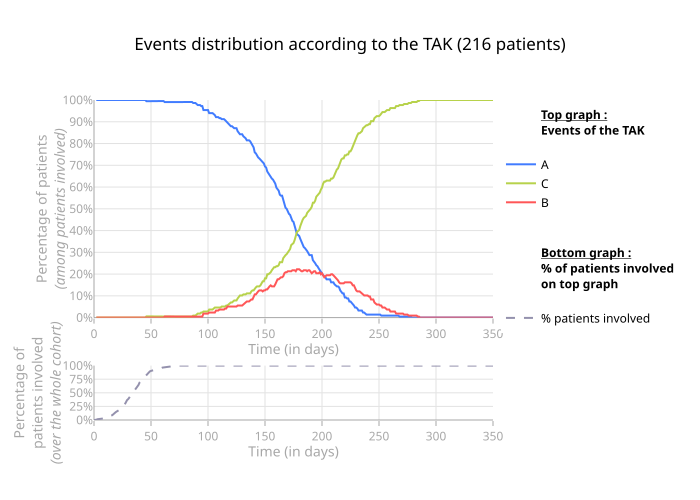

# Usage basique

## Initialisation

### Données

La table de base doit respecter ce format :

| ID_PATIENT | TIMESTAMP |  EVT |
| ---------: | :-------- | ---: |
|          0 | 0         |   in |
|          0 | 15        |    A |
|          0 | 32        |    B |
|          0 | 160       |  out |
|          1 | 0         |   in |
|          1 | 11        |    C |
|          1 | 54        |  out |

!!! warning "Conditions à vérifier"

    - Chaque patient doit avoir un `in` en premier évènement
    - Chaque patient doit avoir un `out` en dernier évènement
    - Un patient ne peut pas avoir plus d'une fois l'évènement `in` ou `out`
    - Un patient ne peut pas avoir plusieurs évènements à la même date

!!! note
    Le package [utils-events](https://aws-git.inadvans.com/hevaweb/data_science/utils-events){class="external-link", target="_blank" } permet de simplifier le traitement de données brutes :

    - Possibilité d'ajouter automatiquement les `in` et `out` avec la fonction de preprocessing `add_in_out()`
    - Possibilité de regroupement d'évènements arrivant à la même date en créant des combinaisons
    - Utiliser la fonction shift_on_first_evt du module utils_events.preprocessing pour changer l'évènement d'alignement

### Initialisation et entraînement

Cet extrait de code permet de créer un objet `TakBuilder` et de l'entraîner.

```python
from tak import TakBuilder

tak = TakBuilder(base).build()
tak.fit(n_clusters = 3)
```

!!! question "Quels sont les paramètres de build possibles ?"

        ``"hca"``
        TAK classique par défaut (Hierarchical Clustering Analysis).

        ``"meta"``
        Meta-TAK, à utiliser sur des grandes cohortes (> 5000 patients).
        Utilise des patients médoides pour augmenter la vitesse de calcul.

        ``"random"``
        Ordre aléatoire.


        Exemple :
        ``` python
        metatak = TakBuilder(base).build("meta")
        ```

Pour plus de détail sur l'implémentation, se référer à l'[usage avancé](advanced.md#choix-de-lalgorithme-de-clustering)

!!! question "Quel temps d'exécution en fonction du nombre de patients ?"
    Le temps d'exécution dépend de beaucoup de paramètres, en particulier du nombre de patients, mais aussi de la durée d'observation.
    Utiliser des distances custom augmente aussi drastiquement le temps de calcul.
    Des simulations sur des jeux de données simulés donnent des résultats assez rapides :
    - 2 minutes pour 3000 patients sur 5 ans
    - 20 minutes pour 5000 patients sur 5 ans
    Cependant, lorsque l'on travaille sur de "vraies" données on est rapidement sur un ordre de grandeur différent : entre 30 minutes et 1 heure pour 2000 patients sur 5 ans.


## Visualisation

#### Initialisation du `TakVisualizer`

Exemple simple

```python
from tak import TakVisualizer

tak_viz = TakVisualizer(tak)
tak_viz.process_visualization()
```

Exemple avec mise à jour des couleurs

```python
from tak import TakVisualizer

tak_viz = TakVisualizer(tak)
tak_viz.update_colors(dict_new_colors={"A": "rgb(255, 114, 64)"}, B="#5E5A85")
tak_viz.process_visualization()
```

#### TAK [1/4]

```python
figplotly = tak_viz.get_plot()
config = {"toImageButtonOptions": {"height": None, "width": None}}
figplotly.show(config=config)
```

!!! warning "Enregistrer l'ordre des IDs dans `/data`"
    C'est une règle de sécurité : quand on livre un TAK, on enregistre dans data/ la liste ordonnée des ids des patients dans le TAK.
    Why ? l'HCA étant un algorithme sensible, quand on change quelques patients légerement, ça peut bouleverser l'ordre de nos clusters.
    L'interprétation clinique n'est pas forcement changée, mais les clients peuvent perdre le fil si les groupes changent d'ordre.
    Enregistrer cette liste d'ID ordonnée permet donc de forcer plus tard l'ordre des TAK.


!!! tip

    Pour automatiquement appliquer la config optimale, il est possible d'importer `nice_plotly_show`

    ```python
    from tak.visualization import nice_plotly_show

    figplotly = tak_viz.get_plot()
    nice_plotly_show(figplotly)
    ```

#### Courbe de répartition [2/4]

```python
fig_events_on_tak_percent = tak_viz.graph_events_rep_on_tak(
    events_not_shown=["start", "in", "out", "end"],
    events_not_in_percent=["start", "in", "out", "end"],
    threshold_percent=0
)
```



!!! note "Courbe de répartition sans le TAK"

    Pour obtenir la courbe de répartition, il faut un objet TakViz à partir duquel on appelle la fonction. On peut obtenir cette courbe sans fitter de tak, en créant un objet TakViz à partir d'un simple TakRandom.


#### Sunburst [3/4]

Le graphe sunburst est généré grâce au package [utils-events](https://hevaweb.pages.inadvans.com/data_science/utils-events/2.2.0/analyse_seq_tt/#sunburst){class="external-link", target="_blank" }.


#### Tableau des durées [4/4]

!!! note
    L'implémentation de `get_ttmt_duration_by_cluster` n'est plus utilisée dans cette version du Tak. Il est préférable de calculer les durées sous traitement à part. 